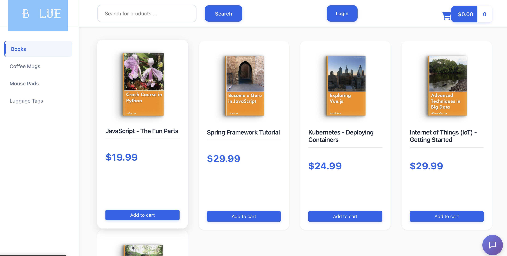
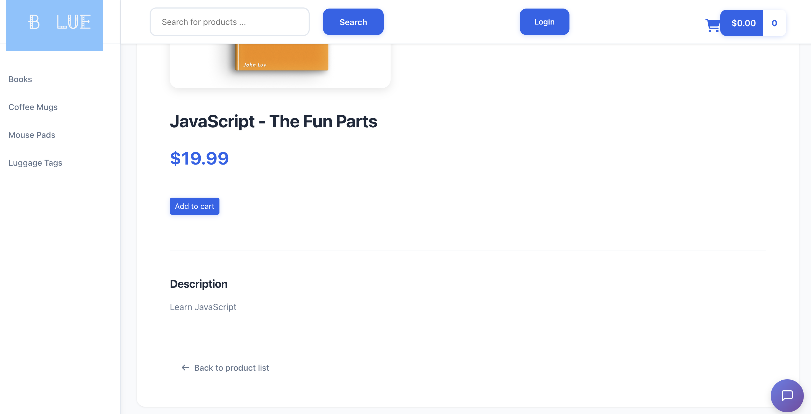
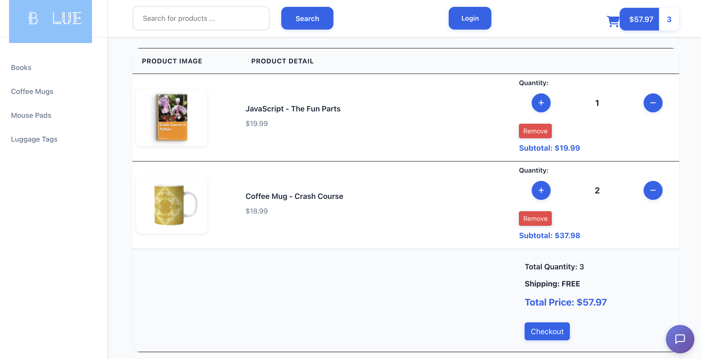
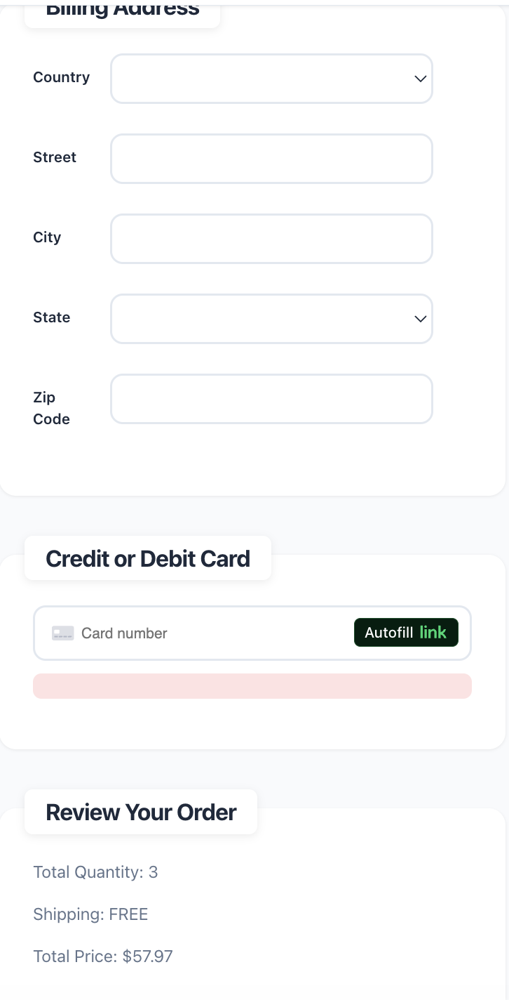
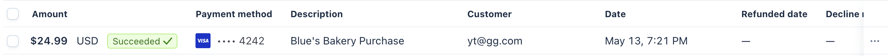

# E-Commerce Website Blue's Bakery

## Overview

This full-stack e-commerce web application provides a robust online shopping experience, enabling users to browse products, search by category or text, manage a shopping cart, process payments via Stripe, and access secure features with Okta authentication. The application uses a monolithic Spring Boot backend with an Angular frontend, with plans for future refactoring into a microservices architecture.

## Features

- **Product Listing**: Display products with name, description, price, and images.
- **Online Shop Template**: Professional e-commerce UI template.
- **Search by Category**: Filter products by categories (e.g., electronics, clothing).
- **Text Search**: Keyword-based product search.
- **Master/Detail View**: List view for summaries and detailed product pages.
- **Pagination**: Paginated product listings for performance.
- **Shopping Cart (CRUD)**: Add, update, or remove cart items.
- **Checkout**: Streamlined purchase process.
- **User Authentication**: Secure login/logout with Okta.
- **VIP Page Access**: Exclusive page for authenticated users.
- **Browser Refresh Handling**: Maintain session state on refresh.
- **Multiple Orders Logic**: Support for concurrent customer orders.
- **Order History**: Track orders for registered users.
- **Secure Communication**: HTTPS for secure interactions.
- **Payment Integration**: Secure payments via Stripe.

## Future Improvements

- Redesign webpage with morden UI - VibeCoding.
- Integrate AI chatbot with local LLM.
- Refactor into microservices (Product, Order, Payment) with Spring Cloud.
- Deploy to cloud platform.


## Prerequisites

- **Java 17**: Install JDK.
- **Node.js**: For Angular (v16+ recommended).
- **Angular CLI**: Install globally with `npm install -g @angular/cli`.
- **MySQL**: For production database. H2 for testing.
- **Okta Account**: For authentication. Disabled when using H2.
- **Stripe Account**: For payments.

## Setup Instructions

### Clone the Repository

```bash
git clone https://github.com/ytangz8/fullstack-ecommerce-angular-springboot.git
```
### Local LLM Setup
1. **Install Ollama**
   ```
   curl -fsSL https://ollama.com/install.sh | sh
   ```

2. **Run local LLM**
   ```
   ollama run llava:7b
   ```

### Backend Setup

1. **Configure MySQL**:

   - Create a database named `ecommerce`.

   - Update `application.properties`:

     ```properties
     spring.datasource.url=jdbc:mysql://localhost:3306/ecommerce
     spring.datasource.username=your-username
     spring.datasource.password=your-password
     ```

2. **Configure Okta**:

   - Create an Okta developer account and application.

   - Update `application.properties`:

     ```properties
     spring.security.oauth2.client.registration.okta.client-id=your-client-id
     spring.security.oauth2.client.registration.okta.client-secret=your-client-secret
     ```

3. **Configure Stripe**:

   - Obtain Stripe API keys and update `application.properties`:

     ```properties
     stripe.api.key=your-secret-key
     ```

4. **Run Backend**:

   ```bash
   cd backend
   mvn clean install
   mvn spring-boot:run
   ```

   - APIs available at `https://localhost:8443api`.

### Frontend Setup

1. **Install Dependencies**:

   ```bash
   cd frontend
   npm install
   ```

2. **Configure Okta**:

   - Install Okta Angular SDK: `npm install @okta/okta-angular @okta/okta-auth-js`.

   - Update `app.module.ts` with Okta configuration.

3. **Run Frontend**:

   ```bash
   npm start
   ```

   - Access at `https://localhost:4200`.

## Screenshots
- Product listing

- PDP page

- Cart and checkout


- Payment with Stripe:

- Local LLM AI Chatbot:
- 


## License

MIT License.

## Acknowledgments

- Chad Darby’s Udemy course.
- Okta and Stripe documentation.
